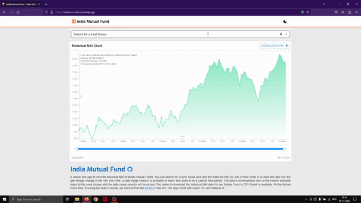

A simple web app to view the historical NAV of Indian Mutual Funds. You can search for a fund house and view the historical NAV for one of their funds in a chart and also see the percentage change in the NAV over time. A date range selector is available to select and zoom in on a specific time period. The chart was made with D3 and is complete with transitions, graidents, and tooltips. You can also download the full scale NAV data (not downsampled) as a CSV file. All the Mutual Fund data, including the search results, are fetched from the [MFAPI.in](https://www.mfapi.in/) free API. The App is built with React, D3, and Material UI.
## Demo

## How to use
1. Type the name of the Fund house (eg: Axis, HDFC, SBI, ICICI etc.) or the type of fund (equity, debt, gold etc.) you want to search for in the search bar and then select a fund from the search results.
2. The chart will show the historical NAV of the selected fund. You can hover over the chart to see the NAV for a specific date. You can also zoom in on a specific time period by selecting a date range.
3. You can download the historical NAV data for the fund in CSV format by clicking the download button.

## Features
1. Search autocomplete for Mutual Fund names.
2. Historical NAV chart with tooltips and date range selector.
3. Color coded chart to indicate positive/negative NAV change.
4. Download historical NAV data in CSV format.

## Want to run it locally?
1. Clone the repository.
2. Run `npm install` to install the dependencies.
3. Get API URL from [MFAPI.in](https://www.mfapi.in/) and set it as the value of `VITE_MFAPI_URL` in the `.env` file.
4. Run `npm run dev` to start the development server.

## Site link
## https://indiamf.pages.dev/